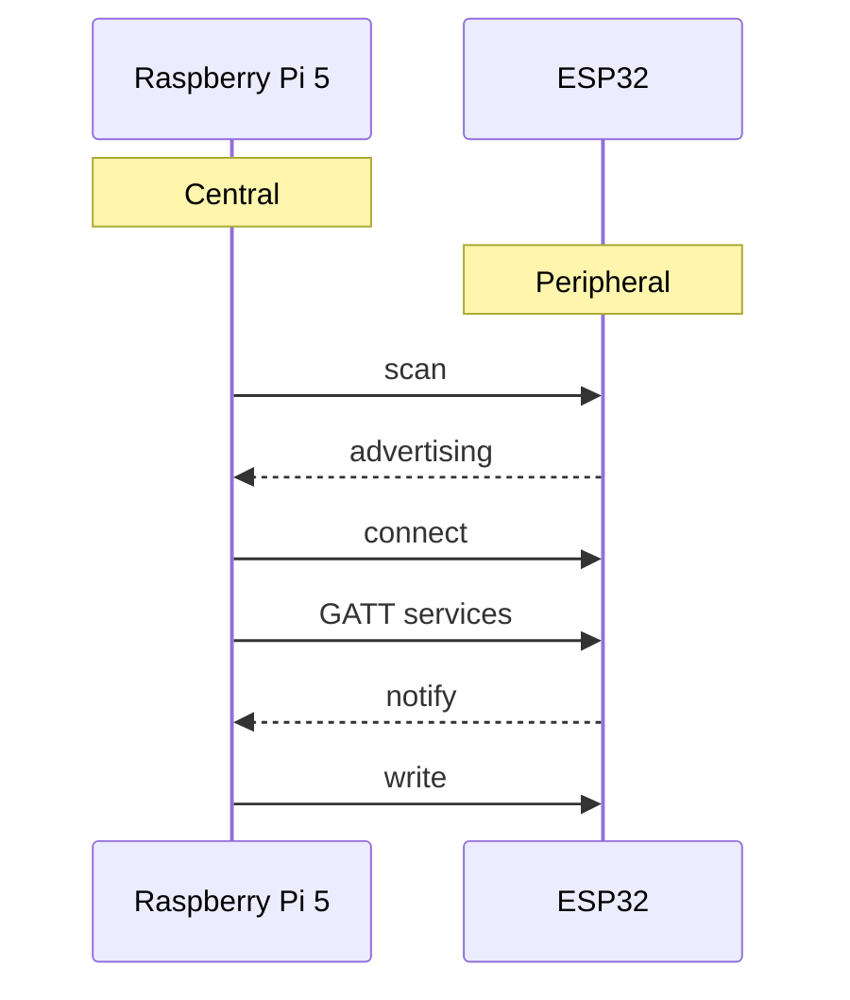
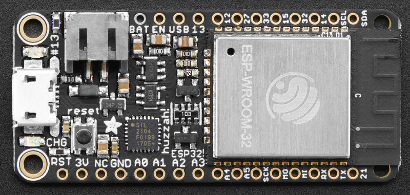

---
mathjax:
  presets: '\def\lr#1#2#3{\left#1#2\right#3}'
---

# Introductie: Bluetooth Low Energy met ESP32 en Raspberry Pi

## Leerdoelen

Na deze cursus kunnen studenten:

> - •	uitleggen wat Bluetooth en Bluetooth Low Energy (BLE) zijn; 
> - •	het verschil tussen Bluetooth Classic en BLE uitleggen; 
> - •	de begrippen **central, peripheral, advertising, scanning en connection** verklaren; 
> - •	uitleggen wat een **GATT service** en **characteristic** zijn; 
> - •	UUID's herkennen en begrijpen; 
> - •	uitleggen wat **notify** en **write** betekenen; 
> - •	een BLE-verbinding opbouwen tussen een ESP32 en Raspberry Pi; 
> - •	MicroPython-code voor een BLE peripheral analyseren; 
> - •	Python/Bleak-code voor een BLE central analyseren; 
> - •	data versturen van ESP32 → Raspberry Pi; 
> - •	data versturen van Raspberry Pi → ESP32; 
> - •	BLE combineren met een MQTT-architectuur. 

## Wat is Bluetooth?

Bluetooth is een draadloze communicatietechnologie voor korte afstanden.
Bluetooth gebruikt de 2,4 GHz ISM-band.
De technologie is ontworpen voor communicatie tussen apparaten zoals:

•	smartphones; 
•	computers; 
•	sensoren; 
•	hoofdtelefoons; 
•	wearables; 
•	microcontrollers; 
•	industriële apparaten. 

Bluetooth bestaat tegenwoordig uit twee belangrijke families:

> - Bluetooth Classic
> - Bluetooth Low Energy (BLE)

Onze ESP32 gebruikt:
***Bluetooth Low Energy (BLE).***

## Bluetooth Classic versus BLE

| Eigenschap               | Bluetooth Classic         | BLE                      |
| ------------------------ | ------------------------- | ------------------------ |
| Energieverbruik          | relatief hoog             | zeer laag                |
| Typische toepassing      | audio, seriële verbinding | sensoren, IoT            |
| Communicatiemodel        | verbinding/stream         | services/characteristics |
| Batterijgevoede sensoren | minder geschikt           | zeer geschikt            |
| Datahoeveelheid          | hoger                     | meestal kleiner          |
| ESP32                    | ja                        | ja                       |

> :bulb: **Opmerking:** BLE is niet gewoon een "draadloze UART".

BLE gebruikt een **gestructureerd protocol** gebaseerd op GATT.

Wij maken met de Nordic UART Service een UART-achtige interface bovenop BLE.

## BLE in één afbeelding

De communicatie die wij gebruiken ziet er conceptueel zo uit:

:::warning
In ons project:
**ESP32 = Peripheral**
**Raspberry Pi = Central**
:::    

## Peripheral en Central

Dit is een belangrijk onderscheid.

### Peripheral

Een BLE peripheral:

> - maakt zichzelf bekend;
> - zendt advertising packets uit;
> - wacht op een central;
> - bevat services en characteristics.

Onze ESP32 is dus de peripheral.

### Central

Een BLE central:

> - zoekt naar BLE-apparaten;
> - ontvangt advertising;
> - > - maakt verbinding;
> - gebruikt de services en characteristics.

Onze Raspberry Pi is de central.

:::warning
De rollen zijn niet hetzelfde als zender en ontvanger.
:::

Tijdens een BLE-verbinding kunnen beide apparaten data versturen.

Dus:

ESP32  ──────────────► Raspberry Pi
       Teller

ESP32  ◄────────────── Raspberry Pi
       Commando

<YoutubeVideo videoId="fr1E9aVnBxw" />

Probeersel

$e^{i\pi}+1=0$

$\delta = \frac{T_{on}} {T}.100\%$