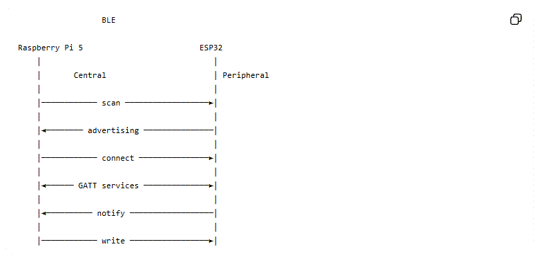
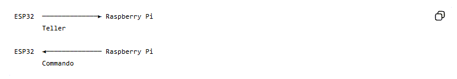
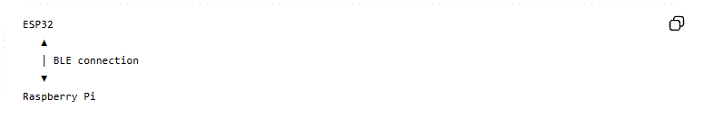

---
mathjax:
  presets: '\def\lr#1#2#3{\left#1#2\right#3}'
---

# Introductie: Bluetooth Low Energy met ESP32 en Raspberry Pi

## Leerdoelen

Na deze cursus kunnen studenten:

> - •	uitleggen wat Bluetooth en Bluetooth Low Energy (BLE) zijn; 
> - •	het verschil tussen Bluetooth Classic en BLE uitleggen; 
> - •	de begrippen **central, peripheral, advertising, scanning en connection** verklaren; 
> - •	uitleggen wat een **GATT service** en **characteristic** zijn; 
> - •	UUID's herkennen en begrijpen; 
> - •	uitleggen wat **notify** en **write** betekenen; 
> - •	een BLE-verbinding opbouwen tussen een ESP32 en Raspberry Pi; 
> - •	MicroPython-code voor een BLE peripheral analyseren; 
> - •	Python/Bleak-code voor een BLE central analyseren; 
> - •	data versturen van ESP32 → Raspberry Pi; 
> - •	data versturen van Raspberry Pi → ESP32; 
> - •	BLE combineren met een MQTT-architectuur. 

## Wat is Bluetooth?

Bluetooth is een draadloze communicatietechnologie voor korte afstanden.
Bluetooth gebruikt de 2,4 GHz ISM-band.
De technologie is ontworpen voor communicatie tussen apparaten zoals:

•	smartphones; 
•	computers; 
•	sensoren; 
•	hoofdtelefoons; 
•	wearables; 
•	microcontrollers; 
•	industriële apparaten. 

Bluetooth bestaat tegenwoordig uit twee belangrijke families:

> - Bluetooth Classic
> - Bluetooth Low Energy (BLE)

Onze ESP32 gebruikt:
***Bluetooth Low Energy (BLE).***

## Bluetooth Classic versus BLE

| Eigenschap               | Bluetooth Classic         | BLE                      |
| ------------------------ | ------------------------- | ------------------------ |
| Energieverbruik          | relatief hoog             | zeer laag                |
| Typische toepassing      | audio, seriële verbinding | sensoren, IoT            |
| Communicatiemodel        | verbinding/stream         | services/characteristics |
| Batterijgevoede sensoren | minder geschikt           | zeer geschikt            |
| Datahoeveelheid          | hoger                     | meestal kleiner          |
| ESP32                    | ja                        | ja                       |

> :bulb: **Opmerking:** BLE is niet gewoon een "draadloze UART".

BLE gebruikt een **gestructureerd protocol** gebaseerd op GATT.

Wij maken met de Nordic UART Service een UART-achtige interface bovenop BLE.

## BLE in één afbeelding

De communicatie die wij gebruiken ziet er conceptueel zo uit:




:::warning
In ons project:

**ESP32 = Peripheral**

**Raspberry Pi = Central**
:::    

## Peripheral en Central

Dit is een belangrijk onderscheid.

### Peripheral

Een BLE peripheral:

> - maakt zichzelf bekend;
> - zendt advertising packets uit;
> - wacht op een central;
> - bevat services en characteristics.

Onze ESP32 is dus de peripheral.

### Central

Een BLE central:

> - zoekt naar BLE-apparaten;
> - ontvangt advertising;
> - > - maakt verbinding;
> - gebruikt de services en characteristics.

Onze Raspberry Pi is de central.

:::warning
De rollen zijn niet hetzelfde als zender en ontvanger.
:::

Tijdens een BLE-verbinding kunnen beide apparaten data versturen.

Dus:



### Advertising

Voordat de Raspberry Pi verbinding kan maken, moet de ESP32 zich bekendmaken.

Dat noemen we:

**advertising.**

Onze code:

```python
self.ble.gap_advertise(
    100000,
    adv_data=payload
)
```

Hier gebeurt iets belangrijks.

De ESP32 zendt periodiek een klein BLE-pakket uit.

De Raspberry Pi luistert daarnaar.

### Advertising interval

In:

```python
self.ble.gap_advertise(
    100000,
    adv_data=payload
)
```

staat `10000`, een waarde uitgedrukt in microseconden. Dus 10000 µs = 0,1 s.
De ESP32 adverteert dus ongeveer iedere 100 ms.

:::warning
**Waarom niet iedere milliseconde?** 
Omdat BLE ontworpen is voor laag energieverbruik.
Een korter advertising interval betekent:
> - sneller gevonden; 
> - maar meer energieverbruik.

Een langer interval betekent:
> - lager energieverbruik;
> - maar ietys langere zoektijd.
:::

### Advertising packet

Onze ESP32-code maakt:

```python
payload = bytearray(b"\x02\x01\x06")
```

Dit zijn drie bytes, ze bevatten BLE flags. Vervolgens:

```python
name = self.name.encode()

payload += bytes(
    [len(name)+1, 0x09]
)

payload += name
```

:::tip
Hier voegen we de naam die we willen geven aan de ESP32: Kies zelf een logische naam!!
Bijvoorbeeld:  `ESP32-Feather`
:::

De Raspberry Pi kan deze naam vervolgens tijdens het scannen zien.

### Scanning

De Raspberry Pi gebruikt:

```python
device = await BleakScanner.find_device_by_name(
    DEVICE_NAME,
    timeout=10
)
```

Hiermee zoekt Bleak naar eeen BLE-apparaat met device naam: `ESP32-Feather`. De Raspberry Pi is hier de **BLE Central**.

### MAC-adres

Tijdens het scannen zagen we bijvoorbeeld: `94:B9:7E:6B:0E:4A`. 
Dit is het Bluetooth-adres.
Het lijkt op een MAC-adres van Ethernet: `XX:XX:XX:XX:XX:XX`
Het adres kan gebruikt worden om een specifiek apparaat te identificeren.
Maar in onze software gebruiken we: `DEVICE_NAME = "ESP32-Feather"`
Dat is voor dit experiment eenvoudiger.

### Verbinding maken

De Raspberry Pi doet:

```python
client = BleakClient(device)

await client.connect()
```
Hierdoor ontstaat een BLE connection. En krijgen we:



Pas vanaf dit moment kunnen we de GATT-database van de ESP32 gebruiken.
