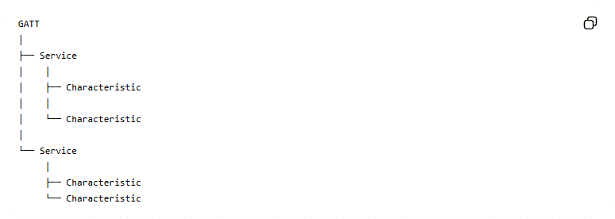
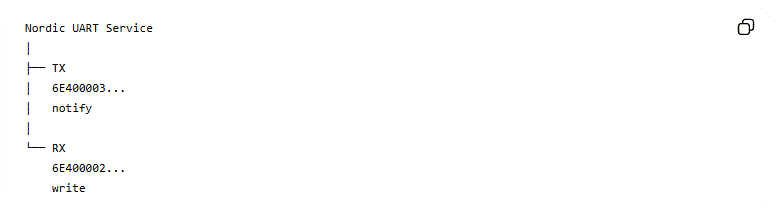
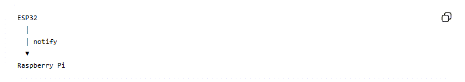
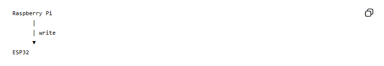
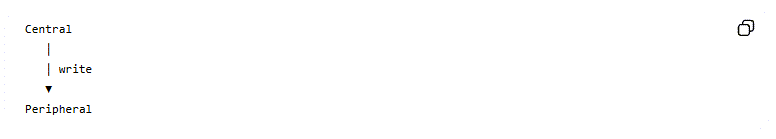
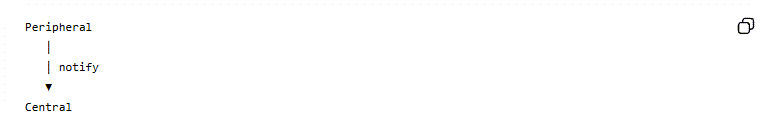

---
mathjax:
  presets: '\def\lr#1#2#3{\left#1#2\right#3}'
---

# GATT

Dit is waarschijnlijk het belangrijkste concept van deze cursus. **GATT = Generic Attribute Profile**. GATT beschrijft hoe gegevens binnen BLE worden georganiseerd.
De structuur is:



## Service

Een `service` groepeert functionaliteit. Onze ESP32 heeft de **Nordic UART Service**0 met `UUID`: `6E400001-B5A3-F393-E0A9-E50E24DCCA9E`, in MicroPython code staat dit als:

```python
_UART_UUID = bluetooth.UUID(
    "6E400001-B5A3-F393-E0A9-E50E24DCCA9E"
)
```

:::warning
Je zal deze UUID moeten personaliseren. Je kan niet met meerdere devices in de ruimte hetzelfde nummer bevatten. Spreek dus met elkaar!!!!
:::

## UUID

UUID betekent:**Universally Unique Identifier**. Een BLE service of characteristic krijgt een UUID.

Daardoor kan een programma precies aangeven:

> Ik wil deze specifieke service gebruiken.

Een UUID is 128 bit: 32 hexadecimale tekens, bijvoorbeeld: `6e400001b5a3f393e0a9e50e24dcca9e`

## De Nordic UART Service

De NUS is geen echte UART-interface. Het is een BLE-service die zich **gedraagt als een UART**. De service bevat twee characteristics:



Dit is de kern van ons systeem.

## TX characteristic

Onze ESP32 definieert:

```python
_UART_TX = bluetooth.UUID(
    "6E400003-B5A3-F393-E0A9-E50E24DCCA9E"
)
```

en 

```python
(
    _UART_TX,
    bluetooth.FLAG_NOTIFY
)
```

`TX` betekent hier: data die de ESP32 naar de central stuurt.
Dus:



## RX characteristic

De RX characteristic:

```python
_UART_RX = bluetooth.UUID(
    "6E400002-B5A3-F393-E0A9-E50E24DCCA9E"
)
```

wordt geregistreerd met:

```python
(
    _UART_RX,
    bluetooth.FLAG_WRITE
)
```

Dat betekent dat de central naar deze characteristic kan schrijven.
Dus:



## Notify versus Write

Dit onderscheid moet je goed begrijpen.

### Write

De central schrijft data naar een characteristic:



Onze code:

```python
await client.write_gatt_char(
    ble_rx,
    message.encode()
)
```

### Notify

De peripheral stuurt spontaan data naar de central:



ESP32:

```python
self.ble.gatts_notify(
    conn,
    self.tx_handle,
    text
)
```

## Notification activeren

De Raspberry Pi moet eerst aangeven dat hij notificaties wil ontvangen. Dat gebeurt met:

```python
await client.start_notify(
    tx,
    ble_notification_handler
)
```

Daarna roept Bleak automatisch deze functie aan:

```python
def ble_notification_handler(sender, data):

    bericht = data.decode(
        "utf-8",
        errors="replace"
    ).strip()
```

Wanneer de ESP32: `TELLER:10` stuurt, komt dat hier binnen.

