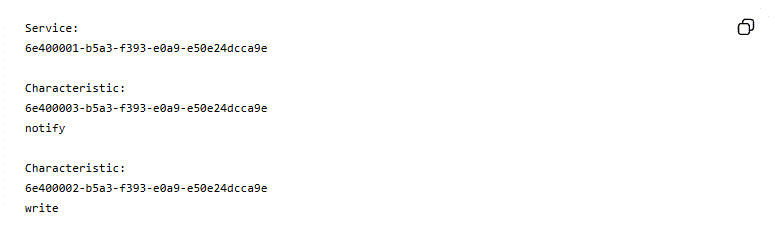
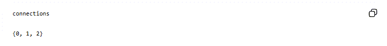
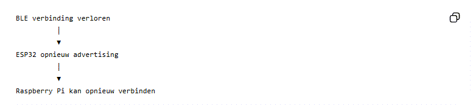
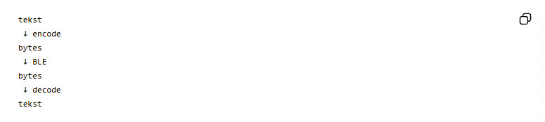
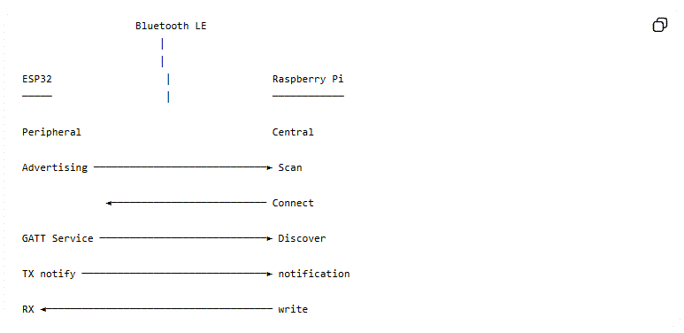
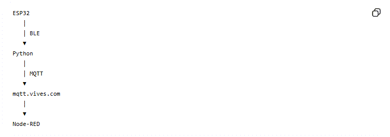

---
mathjax:
  presets: '\def\lr#1#2#3{\left#1#2\right#3}'
---

# GATT

Dit is waarschijnlijk het belangrijkste concept van deze cursus. **GATT = Generic Attribute Profile**. GATT beschrijft hoe gegevens binnen BLE worden georganiseerd.
De structuur is:


## Service

Een `service` groepeert functionaliteit. Onze ESP32 heeft de **Nordic UART Service**0 met `UUID`: `6E400001-B5A3-F393-E0A9-E50E24DCCA9E`, in MicroPython code staat dit als:

```python
_UART_UUID = bluetooth.UUID(
    "6E400001-B5A3-F393-E0A9-E50E24DCCA9E"
)
```

:::warning
Je zal deze UUID moeten personaliseren. Je kan niet met meerdere devices in de ruimte hetzelfde nummer bevatten. Spreek dus met elkaar!!!!
:::

## UUID

UUID betekent:**Universally Unique Identifier**. Een BLE service of characteristic krijgt een UUID.

Daardoor kan een programma precies aangeven:

> Ik wil deze specifieke service gebruiken.

Een UUID is 128 bit: 32 hexadecimale tekens, bijvoorbeeld: `6e400001b5a3f393e0a9e50e24dcca9e`

## De Nordic UART Service

De NUS is geen echte UART-interface. Het is een BLE-service die zich **gedraagt als een UART**. De service bevat twee characteristics:


Dit is de kern van ons systeem.

## TX characteristic

Onze ESP32 definieert:

```python
_UART_TX = bluetooth.UUID(
    "6E400003-B5A3-F393-E0A9-E50E24DCCA9E"
)
```

en 

```python
(
    _UART_TX,
    bluetooth.FLAG_NOTIFY
)
```

`TX` betekent hier: data die de ESP32 naar de central stuurt.
Dus:


## RX characteristic

De RX characteristic:

```python
_UART_RX = bluetooth.UUID(
    "6E400002-B5A3-F393-E0A9-E50E24DCCA9E"
)
```

wordt geregistreerd met:

```python
(
    _UART_RX,
    bluetooth.FLAG_WRITE
)
```

Dat betekent dat de central naar deze characteristic kan schrijven.
Dus:


## Notify versus Write

Dit onderscheid moet je goed begrijpen.

### Write

De central schrijft data naar een characteristic:


Onze code:

```python
await client.write_gatt_char(
    ble_rx,
    message.encode()
)
```

### Notify

De peripheral stuurt spontaan data naar de central:


ESP32:

```python
self.ble.gatts_notify(
    conn,
    self.tx_handle,
    text
)
```

## Notification activeren

De Raspberry Pi moet eerst aangeven dat hij notificaties wil ontvangen. Dat gebeurt met:

```python
await client.start_notify(
    tx,
    ble_notification_handler
)
```

Daarna roept Bleak automatisch deze functie aan:

```python
def ble_notification_handler(sender, data):

    bericht = data.decode(
        "utf-8",
        errors="replace"
    ).strip()
```

Wanneer de ESP32: `TELLER:10` stuurt, komt dat hier binnen.

## De BLE-database van onze ESP32

De Raspberry Pi ontdekte:



Dit kunnen studenten rechtstreeks vergelijken met de ESP32-code. ESP32:  
`_UART_UUID` -> `6e400001...`
`_UART_TX` -> `6e400003...`
`_UART_RX` -> `6e400002...`

## Wat gebeurt er bij verbinding?

De ESP32 ontvangt een BLE-event:

```python
if event == _IRQ_CENTRAL_CONNECT:
```
Daarna:
```python
conn_handle, _, _ = data
```
De `conn_handle` identificeert de actieve BLE-verbinding. Vervolgens:
```python
self.connections.add(conn_handle)
```
De verbinding wordt opgeslagen.

## Waarom een set()?

De code gebruikt: `self.connections = set()`. Een ESP32 kan in principe meerdere BLE-centrals ondersteunen. De actieve verbindingen worden daarom bijgehouden in een set:



Elke waarde is een `conn_handle`. Daarna:
```python
for conn in self.connections:
```
kan de ESP32 data naar alle verbonden centrals sturen.

## BLE disconnect

Wanneer de verbinding verbroken wordt:
```python
self.connections.discard(
    conn_handle
)
```
Daarna:
```python
self._advertise()
```
De ESP32 begint opnieuw met advertising. Dat betekent:



Dit is een belangrijk principe voor IoT-systemen.

## Data ontvangen op de ESP32

Wanneer de Raspberry Pi schrijft naar RX:

```python
elif event == _IRQ_GATTS_WRITE:
```
wordt de RX-handle gecontroleerd:
```python
if value_handle == self.rx_handle:
```
Daarna lezen we:
```python
data = self.ble.gatts_read(
    self.rx_handle
)
```
De bytes worden omgezet naar tekst:
```python
self.last_command = data.decode().strip()
```
Bijvoorbeeld: `LEDON`

## Waarom zijn BLE-berichten bytes?

BLE transporteert uiteindelijk bytes. Bijvoorbeeld: `LEDON` wordt: `4C 45 44 4F 4E` , daarom doen we:

```python
message.encode("utf-8")
```
en bij ontvangst:
```python
data.decode("utf-8")
```
Conceptueel:


## Onze volledige communicatie

De volledige keten is:



Daarna komt MQTT:



## Belangrijke BLE-parameters

| Parameter            | Betekenis                | In ons project       |
| -------------------- | ------------------------ | -------------------- |
| BLE                  | Bluetooth Low Energy     | ja                   |
| Central              | zoekt/verbindt           | Raspberry Pi         |
| Peripheral           | adverteert               | ESP32                |
| Advertising          | apparaat bekendmaken     | ESP32                |
| Advertising interval | tijd tussen advertising  | 100 ms               |
| GATT                 | datastructuur            | ja                   |
| Service              | groep functionaliteit    | NUS                  |
| Characteristic       | datapunt                 | TX/RX                |
| UUID                 | unieke identificatie     | 128 bit              |
| Notify               | peripheral → central     | TX                   |
| Write                | central → peripheral     | RX                   |
| conn_handle          | verbinding identificeren | ESP32                |
| RSSI                 | signaalsterkte           | bijvoorbeeld −58 dBm |
