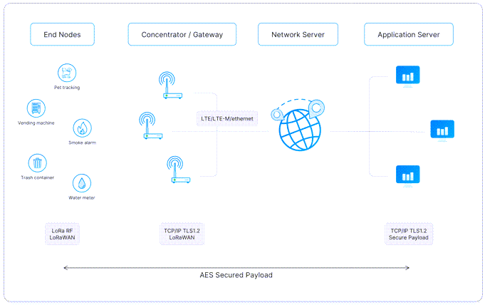
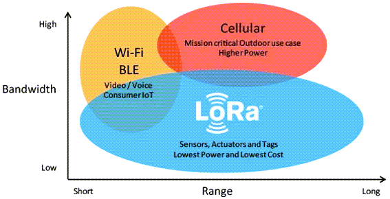

# Cursus LoRa en LoRaWAN
## Van radiosignaal tot The Things Network

**Doelgroep:** studenten STEM, elektronica, IoT en programmeren  
**Niveau:** basiskennis elektriciteit, elektronica en programmeren  
**Duur:** ongeveer 3 à 4 uur theorie + labo  
**Technologie:** LoRa, LoRaWAN, The Things Network (TTN)

---

## 1. Leerdoelen

Na deze cursus kan de student:

- uitleggen wat LoRa en LoRaWAN zijn;
- het verschil tussen **LoRa**, **LoRaWAN** en **The Things Network** uitleggen;
- de belangrijkste eigenschappen van een LoRa-radiosignaal verklaren;
- uitleggen wat **spreading factor (SF)**, **bandwidth (BW)** en **coding rate (CR)** betekenen;
- uitleggen waarom LoRa geschikt is voor IoT-toepassingen met laag energieverbruik;
- de werking van een LoRaWAN-netwerk beschrijven;
- de rol van een **end device**, **gateway**, **network server** en **application server** uitleggen;
- een LoRaWAN-device registreren in The Things Network;
- het verschil tussen **OTAA** en **ABP** uitleggen;
- **DevEUI**, **JoinEUI/AppEUI** en **AppKey** herkennen en correct gebruiken;
- uplink- en downlinkberichten begrijpen;
- uitleggen waarom LoRaWAN niet bedoeld is voor grote hoeveelheden data;
- een eenvoudige LoRaWAN-toepassing ontwerpen en testen.

---

<YoutubeVideo videoId="ZsVhYiX4_6o" />

# 2. Waarom LoRa?

Veel IoT-toepassingen moeten kleine hoeveelheden gegevens over een grote afstand versturen.

Denk bijvoorbeeld aan:

- een temperatuursensor in een landbouwveld;
- een watermeter;
- een energiemeter;
- een sensor in een afvalcontainer;
- een weerstation;
- een sensor die de luchtkwaliteit meet;
- een asset tracker;
- een sensor die slechts enkele keren per uur meet.

WiFi is hiervoor vaak niet geschikt. WiFi heeft relatief veel energie nodig en het bereik is beperkt.

Bluetooth heeft een nog kleiner typisch bereik.

Mobiele netwerken hebben een groot bereik, maar gebruiken meer energie en vereisen doorgaans een abonnement of SIM/eSIM.

LoRa is ontworpen voor een andere situatie:

> **kleine hoeveelheden data, over grote afstand, met zeer weinig energie.**

Dit maakt LoRa bijzonder geschikt voor IoT.

---

# 3. LoRa, LoRaWAN en TTN: drie verschillende begrippen

Een belangrijke eerste stap is het onderscheid tussen drie begrippen.

## 3.1 LoRa

**LoRa** staat voor **Long Range**.

LoRa is een **radiotechnologie** voor draadloze communicatie.

LoRa bepaalt onder andere hoe bits worden omgezet in een radiosignaal.

LoRa gebruikt een modulatiemethode die gebaseerd is op **Chirp Spread Spectrum (CSS)**.

LoRa is dus vergelijkbaar met een fysieke communicatietechnologie zoals:

- WiFi-radio;
- Bluetooth-radio;
- Zigbee-radio.

LoRa zegt op zichzelf nog niets over hoe een volledig IoT-netwerk wordt georganiseerd.

---

## 3.2 LoRaWAN

**LoRaWAN** staat voor **Long Range Wide Area Network**.

LoRaWAN is een **netwerkprotocol** dat LoRa gebruikt als fysieke radiotechnologie.

LoRaWAN beschrijft bijvoorbeeld:

- hoe apparaten zich aanmelden;
- hoe berichten worden verzonden;
- hoe gateways berichten doorsturen;
- hoe apparaten worden geïdentificeerd;
- hoe beveiliging wordt geregeld;
- hoe uplink en downlink werken;
- hoe een netwerkserver berichten verwerkt.

Een eenvoudige manier om het verschil te onthouden:

> **LoRa = de radioverbinding**  
> **LoRaWAN = het netwerkprotocol**

---

## 3.3 The Things Network

**The Things Network (TTN)** is een publiek LoRaWAN-netwerk dat deel uitmaakt van **The Things Stack**.

TTN levert onder andere netwerkserverfunctionaliteit en laat LoRaWAN-gateways samenwerken met applicaties.

De architectuur kan vereenvoudigd worden voorgesteld als:

```text
Sensor
  |
  | LoRa
  v
Gateway
  |
  | Internet
  v
The Things Network / The Things Stack
  |
  v
Applicatie
```

TTN is dus **geen andere radiotechnologie naast LoRa**.

TTN gebruikt LoRaWAN.

---

# 4. De lagen van een LoRaWAN-systeem

Een LoRaWAN-systeem bestaat uit verschillende lagen.

```text
+-----------------------------+
|       Applicatie            |
|   dashboard / database      |
+-----------------------------+
             ^
             |
       Application Server
             ^
             |
       Network Server
             ^
             |
         Internet
             ^
             |
          Gateway
             ^
             |
            LoRa
             ^
             |
        End Device
```

## 4.1 End device

Het **end device** is het apparaat dat gegevens meet of een actuator aanstuurt.

Voorbeelden:

- ESP32 + LoRa-module;
- RAK-module;
- Arduino + LoRa-module;
- industriële sensor;
- batterijgevoede IoT-sensor.

Een end device bevat typisch:

- microcontroller;
- LoRa-transceiver;
- sensor;
- batterij of voeding.

---

## 4.2 Gateway

Een **LoRaWAN-gateway** ontvangt LoRa-radiosignalen van verschillende end devices.

Een gateway kan bijvoorbeeld honderden of duizenden apparaten ondersteunen.

Belangrijk:

> Een gateway communiceert niet uitsluitend met één sensor.

Een gateway ontvangt berichten van veel verschillende LoRaWAN-devices.

De gateway stuurt ontvangen berichten vervolgens via Ethernet, WiFi of mobiel internet naar een LoRaWAN-server.

---

## 4.3 Network Server

De **network server** beheert het LoRaWAN-netwerk.

De network server:

- controleert berichten;
- verwerkt metadata;
- beheert gateways;
- bepaalt welke gateway het meest geschikt is voor downlinks;
- beheert bepaalde netwerkfuncties;
- helpt bij het beheer van devices.

Bij TTN wordt dit uitgevoerd door de The Things Stack.

---

## 4.4 Application Server

De application server ontvangt de gegevens die voor de toepassing bestemd zijn.

Bijvoorbeeld:

```text
Temperatuur = 22,4 °C
Luchtvochtigheid = 58 %
```

De application server kan de gegevens vervolgens doorgeven aan:

- Node-RED;
- MQTT;
- een database;
- Grafana;
- een webapplicatie;
- een eigen Python-programma.

---

# 5. Het basisprincipe van LoRa

LoRa gebruikt **Chirp Spread Spectrum (CSS)**.

Een chirp is een radiosignaal waarvan de frequentie geleidelijk verandert.

Een vereenvoudigde voorstelling:

```text
Frequentie
   ^
   |              /
   |            /
   |          /
   |        /
   |      /
   |    /
   |  /
   +----------------------> tijd
```

Een LoRa-symbool wordt gecodeerd door een chirp.

Door de informatie over een relatief breed frequentiegebied te verspreiden, kan de ontvanger zeer zwakke signalen detecteren.

Dit is één van de redenen waarom LoRa een groot bereik kan bereiken.

---

# 6. Belangrijke LoRa-parameters

De belangrijkste parameters waarmee studenten in de praktijk te maken krijgen zijn:

- frequentie;
- bandwidth;
- spreading factor;
- coding rate;
- transmit power.

---

## 6.1 Frequentie

LoRa werkt in verschillende frequentiebanden.

In Europa wordt voor LoRaWAN typisch de **EU868-band** gebruikt.

Dit betekent niet dat elk willekeurig LoRa-signaal zomaar op elke frequentie mag worden uitgezonden.

De toegelaten frequenties en zendvoorwaarden zijn afhankelijk van de regio.

Voor Europa is 868 MHz belangrijk.

---

## 6.2 Bandwidth

De **bandwidth (BW)** bepaalt hoeveel frequentiebandbreedte het LoRa-signaal gebruikt.

Typische LoRa-bandbreedtes zijn:

- 125 kHz;
- 250 kHz;
- 500 kHz.

Een grotere bandwidth betekent doorgaans:

- hogere datasnelheid;
- kortere airtime;
- maar minder gevoeligheid.

Een kleinere bandwidth betekent doorgaans:

- lagere datasnelheid;
- langere airtime;
- hogere gevoeligheid.

---

# 7. Spreading Factor

De **Spreading Factor (SF)** is één van de belangrijkste LoRa-parameters.

Typische waarden zijn:

```text
SF7
SF8
SF9
SF10
SF11
SF12
```

Hoe groter de spreading factor:

- hoe lager de datasnelheid;
- hoe langer een bericht in de lucht blijft;
- hoe groter doorgaans het bereik;
- hoe beter zeer zwakke signalen kunnen worden ontvangen.

Vereenvoudigd:

```text
SF7  -> snel, korte airtime
SF8
SF9
SF10
SF11
SF12 -> traag, lange airtime
```

---

## 7.1 Waarom is SF belangrijk?

Stel dat twee sensoren hetzelfde bericht versturen.

Sensor A:

```text
SF7
```

Sensor B:

```text
SF12
```

Het bericht van sensor B zal aanzienlijk langer duren.

Dat betekent:

- meer energieverbruik;
- meer bezetting van het radiokanaal;
- minder berichten per tijdseenheid.

Daarom is een hoge SF niet automatisch "beter".

De bedoeling is:

> gebruik de laagst mogelijke spreading factor waarmee de verbinding betrouwbaar blijft.

---

# 8. Coding Rate

LoRa gebruikt foutcorrectie.

De **Coding Rate (CR)** bepaalt hoeveel extra informatie wordt toegevoegd om fouten te kunnen detecteren/corrigeren.

Typische LoRa-instellingen worden aangeduid als:

- 4/5;
- 4/6;
- 4/7;
- 4/8.

Meer foutcorrectie betekent:

- robuustere communicatie;
- maar meer verzonden bits;
- dus langere airtime.

---

# 9. Transmit power

De **TX power** bepaalt het zendvermogen.

Een hoger zendvermogen kan het bereik vergroten.

Maar:

- de batterij loopt sneller leeg;
- wettelijke limieten moeten gerespecteerd worden;
- meer vermogen is niet altijd noodzakelijk.

Een goed IoT-ontwerp probeert dus niet zomaar met maximaal vermogen te zenden.

---

# 10. De belangrijkste trade-off

Bij LoRa moeten verschillende eigenschappen tegen elkaar worden afgewogen.

```text
                 hoger SF
                    |
                    v
              groter bereik
                    |
                    v
              langere airtime
                    |
                    v
             meer energie
                    |
                    v
          minder beschikbare
             zendtijd
```

Daarom is LoRa een technologie van compromissen.

Een ontwerp moet rekening houden met:

- bereik;
- datasnelheid;
- energieverbruik;
- airtime;
- betrouwbaarheid.

---

# 11. Airtime

**Airtime** is de tijd dat een LoRa-pakket daadwerkelijk wordt uitgezonden.

Airtime wordt onder andere beïnvloed door:

- spreading factor;
- bandwidth;
- payloadlengte;
- coding rate;
- preamble.

Bij hogere SF wordt de airtime langer.

Dit is belangrijk omdat LoRaWAN bedoeld is voor relatief kleine hoeveelheden data.

Een bericht van bijvoorbeeld:

```text
22,4 °C
```

kan veel efficiënter worden verstuurd als een compacte binaire waarde dan als een lange tekststring.

---

# 12. Waarom LoRa geen WiFi-vervanger is

LoRa heeft een groot bereik, maar een zeer beperkte datasnelheid.

WiFi:

- hoge datasnelheid;
- relatief korte afstand;
- relatief hoog energieverbruik.

LoRa:

- lage datasnelheid;
- groot bereik;
- laag energieverbruik.

Een toepassing zoals:

```text
videostreaming
```

is totaal ongeschikt voor LoRa.

Een toepassing zoals:

```text
temperatuur elke 10 minuten
```

is juist zeer geschikt.

---

# 13. LoRaWAN-netwerkarchitectuur

Een belangrijk kenmerk van LoRaWAN is de **star-of-stars** architectuur.

```text
                 Gateway
               /    |    \
              /     |     \
          Device  Device  Device
              \     |     /
               \    |    /
                 Gateway
                    |
                 Internet
                    |
              LoRaWAN server
```

De end devices communiceren rechtstreeks met één of meerdere gateways.

De gateways vormen geen klassieke mesh tussen de sensoren.

---

# 14. Een bericht van sensor naar TTN

Wanneer een sensor een meting verstuurt, verloopt dit ongeveer als volgt:

```text
1. Sensor meet temperatuur
        |
        v
2. Microcontroller maakt payload
        |
        v
3. LoRaWAN-device verstuurt uplink
        |
        v
4. Eén of meerdere gateways ontvangen het signaal
        |
        v
5. Gateway stuurt bericht via internet
        |
        v
6. The Things Stack verwerkt het bericht
        |
        v
7. Applicatie ontvangt de gegevens
```

---

# 15. Uplink en downlink

## Uplink

Een **uplink** gaat:

```text
Device -> Gateway -> Network Server -> Application
```

Bijvoorbeeld:

```text
Temperatuur = 22,5 °C
```

---

## Downlink

Een **downlink** gaat in de andere richting:

```text
Application -> Network Server -> Gateway -> Device
```

Bijvoorbeeld:

```text
Zet relais aan
```

Downlink moet bij LoRaWAN zorgvuldig worden gebruikt, omdat een batterijgevoed device meestal niet continu luistert.

---

# 16. Class A, B en C

LoRaWAN kent verschillende device classes.

## Class A

Dit is de meest energiezuinige klasse.

Het device:

1. verstuurt een uplink;
2. opent daarna korte ontvangstvensters;
3. gaat vervolgens weer slapen.

```text
UPLINK
  |
  +-- RX window
  |
  +-- RX window
  |
 SLEEP
```

Class A is ideaal voor batterijgevoede sensoren.

---

## Class B

Class B gebruikt extra geplande ontvangstvensters.

Hierdoor kan een server een device beter bereiken.

Het energieverbruik is hoger dan bij Class A.

---

## Class C

Class C luistert vrijwel continu.

Voordeel:

- zeer snelle downlinkreactie.

Nadeel:

- veel hoger energieverbruik.

Class C is daarom vooral geschikt voor apparaten die permanent gevoed worden.

---

# 17. LoRaWAN-device registreren

Om een device met TTN te laten communiceren, moet het device correct worden geregistreerd.

Bij een typische OTAA-configuratie zijn belangrijke identifiers:

- **DevEUI**
- **JoinEUI**
- **AppKey**

---

# 18. DevEUI

De **DevEUI** identificeert een specifiek LoRaWAN-device.

Dit is een 64-bit identifier.

Voorbeeld:

```text
70B3D57ED00ABCDE
```

De exacte waarde hangt af van het apparaat.

De DevEUI moet uniek zijn.

---

# 19. JoinEUI

De **JoinEUI** identificeert de join-applicatie/servercontext.

In oudere documentatie wordt vaak de naam **AppEUI** gebruikt.

Belangrijk:

> AppEUI is de oudere naam die je nog vaak in voorbeelden tegenkomt. In de huidige LoRaWAN-terminologie wordt JoinEUI gebruikt.

---

# 20. AppKey

De **AppKey** is een geheime sleutel die gebruikt wordt bij OTAA.

Deze sleutel moet geheim blijven.

De AppKey mag dus niet:

- op GitHub worden gepubliceerd;
- in screenshots worden gedeeld;
- aan andere gebruikers worden doorgestuurd.

Een praktische regel:

> Identifiers mogen vaak gedeeld worden; geheime sleutels niet.

---

# 21. OTAA

**OTAA = Over-The-Air Activation**

Dit is de aanbevolen methode voor de meeste nieuwe toepassingen.

Bij OTAA meldt het device zich aan bij het netwerk.

Vereenvoudigd:

```text
Device
  |
  | Join Request
  v
Gateway
  |
  v
LoRaWAN Network
  |
  | Join Accept
  v
Device
```

Tijdens deze procedure worden de benodigde sessiegegevens opgebouwd.

---

# 22. ABP

**ABP = Activation By Personalization**

Bij ABP worden sessiegegevens vooraf ingesteld.

ABP is eenvoudiger om conceptueel te begrijpen, maar heeft belangrijke nadelen op het gebied van flexibiliteit en beheer.

Voor nieuwe toepassingen is **OTAA meestal de betere keuze**.

---

# 23. Beveiliging

LoRaWAN is ontworpen met beveiliging als belangrijk onderdeel.

Er wordt gebruikgemaakt van cryptografische sleutels om communicatie te beveiligen.

Conceptueel:

```text
Sensor
  |
  | versleutelde data
  v
Gateway
  |
  v
Network Server
  |
  v
Application
```

De gateway hoeft de applicatiegegevens niet noodzakelijk te kunnen lezen.

Dit maakt het mogelijk om netwerk- en applicatieverantwoordelijkheden van elkaar te scheiden.

---

# 24. Payload

Een LoRaWAN-bericht bevat een payload.

Een eenvoudige payload kan bijvoorbeeld zijn:

```text
22.4
```

Maar voor IoT is een compacte binaire representatie vaak efficiënter.

Bijvoorbeeld:

```text
temperatuur = 224
```

waarbij de ontvanger weet dat:

```text
224 / 10 = 22.4 °C
```

Hierdoor hoeft de tekst `"22.4"` niet te worden verstuurd.

---

# 25. Payload formatter

TTN kan een payload formatter gebruiken om binaire data om te zetten naar leesbare gegevens.

Bijvoorbeeld:

```text
Payload:
[0x00, 0xE0]
```

kan worden geïnterpreteerd als:

```text
Temperatuur = 22.4 °C
```

Een payload formatter kan bijvoorbeeld JavaScript bevatten.

Conceptueel:

```javascript
return {
    temperature: bytes[0] + bytes[1] / 10
};
```

De exacte code hangt af van de gekozen payloadstructuur.

---

# 26. Labo: LoRaWAN met ESP32

Een interessante studentenopstelling bestaat uit:

```text
+-------------+
| ESP32       |
| + LoRa      |
| + sensor    |
+-------------+
       |
       | LoRa
       v
+-------------+
| LoRaWAN     |
| Gateway     |
+-------------+
       |
       | Internet
       v
+-------------+
| TTN         |
| Application |
+-------------+
       |
       v
   Dashboard
```

Mogelijke hardware:

- ESP32;
- LoRa-module;
- temperatuur- of lichtsensor;
- LoRaWAN-gateway.



---

# 27. Stappenplan The Things Network

## Stap 1 — Maak een account

Ga naar de website van The Things Network.

Gebruik de officiële TTN-documentatie voor de actuele registratieprocedure.

## Stap 2 — Open een application

Maak in de TTN-console een nieuwe application.

Bijvoorbeeld:

```text
iot-student-01
```

## Stap 3 — Voeg een end device toe

Kies het juiste:

- land/regio;
- LoRaWAN-versie;
- frequency plan;
- activation method.

Voor België is een EU868-configuratie relevant.

## Stap 4 — Vul de identifiers in

Gebruik:

```text
DevEUI
JoinEUI
AppKey
```

## Stap 5 — Programmeer het device

Dezelfde waarden moeten correct in de firmware/configuratie van het device terechtkomen.

## Stap 6 — Start het device

Het device voert een OTAA join uit.

## Stap 7 — Controleer TTN

Wanneer de join lukt, moet het device zichtbaar zijn in de TTN-console.

---

# 28. Gateway versus device

Een veelgemaakte fout is denken dat een LoRaWAN-device rechtstreeks met TTN via internet communiceert.

Dat gebeurt normaal niet.

Een typisch traject is:

```text
ESP32
  |
  | LoRa radio
  v
Gateway
  |
  | Ethernet/WiFi/4G
  v
Internet
  |
  v
TTN
```

De ESP32 zelf hoeft dus geen internetverbinding te hebben.

---

# 29. Eén device kan door meerdere gateways worden ontvangen

LoRaWAN werkt anders dan een klassieke point-to-point verbinding.

Een uplink kan bijvoorbeeld door drie gateways worden ontvangen:

```text
             Gateway A
                ^
               /
              /
Device -------+------- Gateway B
              \
               \
                v
             Gateway C
```

De netwerkserver ontvangt informatie van de gateways en kan daaruit bepalen hoe het bericht verder wordt verwerkt.

Dit is één van de sterke eigenschappen van een LoRaWAN-netwerk.

---

# 30. RSSI en SNR

Bij het testen van een LoRaWAN-verbinding kom je vaak twee belangrijke parameters tegen:

- RSSI;
- SNR.

## RSSI

**RSSI = Received Signal Strength Indicator**

RSSI geeft een indicatie van de ontvangen signaalsterkte.

De waarde wordt typisch uitgedrukt in dBm.

Een voorbeeld:

```text
RSSI = -85 dBm
```

Een minder negatieve waarde betekent doorgaans een sterker signaal.

---

## SNR

**SNR = Signal-to-Noise Ratio**

SNR geeft aan hoe het signaal zich verhoudt tot de ruis.

Een positieve SNR betekent niet automatisch dat een verbinding noodzakelijk beter is dan wanneer de SNR negatief is.

LoRa kan onder bepaalde omstandigheden signalen met een zeer lage SNR nog betrouwbaar ontvangen.

---

# 31. Bereik

Het bereik van LoRa kan zeer groot zijn.

Maar er bestaat geen vaste waarde zoals:

> "LoRa werkt altijd 10 km."

Het bereik hangt af van:

- antenne;
- antennehoogte;
- bebouwing;
- terrein;
- frequentie;
- spreading factor;
- zendvermogen;
- ontvangergevoeligheid;
- interferentie.

In een open gebied kan het bereik veel groter zijn dan in een dichtbebouwde omgeving.

---

# 32. Antenne

De antenne is een essentieel onderdeel van het radiosysteem.

Een slechte antenne kan de prestaties van een uitstekend LoRa-device sterk verminderen.

Belangrijke aspecten:

- juiste frequentie;
- correcte impedantie;
- goede plaatsing;
- voldoende vrije ruimte;
- correcte polariteit/orientatie.

Een antenne die bedoeld is voor 868 MHz is bijvoorbeeld veel geschikter voor EU868 dan een willekeurige antenne.

---

# 33. Energieverbruik

Een typische LoRaWAN-sensor kan zeer energiezuinig zijn.

Een veelgebruikte strategie:

```text
MEET
  |
  v
VERWERK
  |
  v
VERSTUUR
  |
  v
SLAAP
  |
  |
  +----------+
             |
             v
           MEET
```

De microcontroller en radio staan het grootste deel van de tijd in een slaapmodus.

Dit maakt batterijlevensduren van maanden of jaren mogelijk, afhankelijk van de toepassing.

---

# 34. Duty cycle

In Europa zijn voor bepaalde sub-banden beperkingen van toepassing op hoe lang een zender een kanaal mag bezetten.

Dit wordt vaak uitgedrukt als een **duty cycle**.

Bijvoorbeeld:

```text
1% duty cycle
```

betekent dat een zender gedurende een bepaalde periode slechts een beperkt deel van de tijd mag uitzenden.

Voor studenten is het belangrijkste inzicht:

> Je kunt niet onbeperkt en continu LoRa-pakketten versturen.

Dit is een belangrijke reden waarom LoRaWAN geschikt is voor kleine, sporadische berichten.

De exacte regels zijn afhankelijk van frequentie, regio en regelgeving.

---

# 35. ADR

**ADR = Adaptive Data Rate**

ADR kan de LoRa-parameters helpen optimaliseren.

Wanneer de verbinding goed is, kan het netwerk bijvoorbeeld een lagere spreading factor gebruiken.

Wanneer een apparaat een goede verbinding heeft:

```text
SF12 -> SF9 -> SF7
```

kan leiden tot:

- kortere airtime;
- lager energieverbruik;
- hogere datasnelheid.

ADR is vooral nuttig bij apparaten die relatief stabiel op één plaats staan.

---

# 36. LoRaWAN is niet geschikt voor alles

LoRaWAN is uitstekend voor:

- temperatuurmetingen;
- vochtmetingen;
- energiemetingen;
- watermeters;
- landbouwsensoren;
- eenvoudige statusmeldingen;
- asset monitoring.

LoRaWAN is minder geschikt voor:

- audio;
- video;
- grote bestanden;
- continue datastromen;
- toepassingen met zeer lage latentie.

---

# 37. Vergelijking met andere draadloze technologieën

| Technologie | Bereik | Datasnelheid | Energieverbruik | Typische toepassing |
|---|---:|---:|---:|---|
| Bluetooth | klein | hoog | laag | accessoires |
| WiFi | middel | zeer hoog | middel/hoog | internet |
| Zigbee | middel | laag/middel | laag | domotica |
| LoRaWAN | groot | laag | zeer laag | IoT |
| 4G/5G | zeer groot | zeer hoog | hoger | mobiel internet |

Deze tabel is een vereenvoudiging. Werkelijke prestaties hangen af van implementatie en omstandigheden.


---

# 38. Begrippenlijst

**LoRa**  
Radiotechnologie gebaseerd op Chirp Spread Spectrum.

**LoRaWAN**  
Netwerkprotocol voor Low Power Wide Area Networks dat LoRa als radio kan gebruiken.

**TTN**  
The Things Network, een publiek LoRaWAN-netwerk en ecosysteem gebaseerd op The Things Stack.

**End device**  
Het IoT-apparaat dat gegevens meet of ontvangt.

**Gateway**  
Apparaat dat LoRaWAN-radioverkeer ontvangt en via IP doorstuurt.

**Network Server**  
Servercomponent die het LoRaWAN-netwerk beheert.

**Application Server**  
Component die applicatiegegevens verwerkt.

**Uplink**  
Bericht van device naar netwerk.

**Downlink**  
Bericht van netwerk naar device.

**DevEUI**  
Unieke identifier van een LoRaWAN-device.

**JoinEUI**  
Identifier voor de join-context; vroeger vaak AppEUI genoemd.

**AppKey**  
Geheime sleutel voor OTAA.

**OTAA**  
Over-The-Air Activation.

**ABP**  
Activation By Personalization.

**SF**  
Spreading Factor.

**BW**  
Bandwidth.

**CR**  
Coding Rate.

**RSSI**  
Received Signal Strength Indicator.

**SNR**  
Signal-to-Noise Ratio.

**ADR**  
Adaptive Data Rate.

**Airtime**  
Tijd waarin een radio-pakket wordt uitgezonden.

---

# 39. Oefeningen

## Oefening 1 — Begrippen

Leg in je eigen woorden uit:

1. Wat is LoRa?
2. Wat is LoRaWAN?
3. Wat is TTN?
4. Wat doet een gateway?
5. Wat doet de network server?

---

## Oefening 2 — Architectuur

Teken het traject van een temperatuurmeting vanaf de sensor tot een dashboard.

Gebruik minstens:

- end device;
- gateway;
- internet;
- network server;
- application.

---

## Oefening 3 — SF

Een sensor gebruikt eerst SF7 en daarna SF12.

Welke configuratie heeft:

- de hoogste datasnelheid?
- de langste airtime?
- normaal het grootste bereik?
- het hoogste energieverbruik per bericht?

Leg uit waarom.

---

## Oefening 4 — OTAA

Welke drie belangrijke gegevens zijn typisch nodig voor een OTAA-device?

**Antwoord:**

```text
DevEUI
JoinEUI
AppKey
```

Leg van elk uit waarvoor het dient.

---

## Oefening 5 — Storingsanalyse

Een device kan geen verbinding maken met TTN.

Maak een checklist met minstens tien mogelijke oorzaken.

Denk aan:

- voeding;
- antenne;
- frequentieplan;
- DevEUI;
- JoinEUI;
- AppKey;
- gateway;
- bereik;
- firmware;
- LoRaWAN-versie.

---

# 40. Labo-opdracht

## Doel

Maak een LoRaWAN-sensor die periodiek een meetwaarde naar The Things Network verstuurt.

## Hardware

Gebruik bijvoorbeeld:

- ESP32;
- LoRa-module;
- sensor;
- antenne;
- voeding.

## Software

De firmware moet:

1. LoRaWAN initialiseren;
2. OTAA gebruiken;
3. verbinding maken met het netwerk;
4. een sensorwaarde meten;
5. de waarde coderen;
6. een uplink versturen;
7. voldoende lang slapen;
8. opnieuw meten.

## Rapport

Beschrijf:

- gebruikte hardware;
- gebruikte frequentieband;
- DevEUI;
- JoinEUI;
- gebruikte SF;
- payloadformaat;
- gemeten RSSI;
- gemeten SNR;
- uplinkinterval;
- batterijverbruik;
- resultaten.

**Let op:** vermeld de AppKey nooit in het verslag als het verslag publiek wordt gedeeld.

---

# 41. Uitbreidingsopdracht

Onderzoek wat er gebeurt wanneer twee LoRaWAN-devices:

- op dezelfde plaats staan;
- dezelfde spreading factor gebruiken;
- tegelijk proberen te zenden.

Beantwoord:

1. Kunnen beide berichten ontvangen worden?
2. Wat gebeurt er bij een botsing?
3. Waarom is LoRaWAN niet hetzelfde als een klassiek point-to-point protocol?
4. Welke rol speelt de gateway?
5. Welke rol speelt de network server?

---

# 42. Samenvatting

De belangrijkste concepten uit deze cursus zijn:

```text
LoRa
  =
radio-technologie
```

```text
LoRaWAN
  =
netwerkprotocol
```

```text
The Things Network
  =
publiek LoRaWAN-netwerk/ecosysteem
```

Een typisch netwerk:

```text
+-------------+
| End Device  |
+-------------+
       |
      LoRa
       |
       v
+-------------+
|   Gateway   |
+-------------+
       |
    Internet
       |
       v
+-------------+
|     TTN     |
| The Things  |
|   Stack     |
+-------------+
       |
       v
+-------------+
| Application |
+-------------+
```

De belangrijkste LoRa-parameters zijn:

```text
Frequency
Bandwidth
Spreading Factor
Coding Rate
Transmit Power
```

De belangrijkste LoRaWAN-begrippen zijn:

```text
Uplink
Downlink
OTAA
ABP
DevEUI
JoinEUI
AppKey
Gateway
Network Server
Application Server
ADR
Class A/B/C
```

Het belangrijkste ontwerpprincipe:

> **Verstuur zo weinig mogelijk data, zo efficiënt mogelijk, en laat het device zo veel mogelijk slapen.**

Dat is precies waarom LoRaWAN zo geschikt is voor veel IoT-toepassingen.

---

# 43. Bronnen en verdere studie

Voor actuele informatie over LoRaWAN, frequentieplannen en The Things Network is het belangrijk om altijd de officiële documentatie te raadplegen.

Aanbevolen:

- The Things Network / The Things Stack documentation
- LoRa Alliance – LoRaWAN-specificaties
- regionale regelgeving voor de 868 MHz-band
- documentatie van de gebruikte LoRa-transceiver
- documentatie van de gebruikte LoRaWAN-library

**Opmerking:** instellingen, firmware-API's en TTN-consolepagina's kunnen wijzigen. Gebruik voor praktische labo's steeds de actuele documentatie naast deze cursus.
