---
mathjax:
  presets: '\def\lr#1#2#3{\left#1#2\right#3}'
---


# ESP32 - Nucleo-LoRaWAN

## Nucleo Lora Module

Dit bordje bezit de nodige elektronica om bij een `LoRa End node` de communicatie te verzorgen. Het bordje kan communiceren met een ander `LoRa module` of met een `LoRa gateway` (in beheer van **The Things Network**). In de gebouwen van VIVES staat reeds een `LoRa gateway` opgesteld. Je kan trouwens de een map raadplegen:

[Map Gateway The Things Network](https://ttnmapper.org/heatmap/)

`The Things Network` zorgt ervoor dat de `LoRa gateway's` een verbinding hebben met het internet. Een eigen gateway opzetten kan je ook altijd zelf doen, maar dit valt hier buiten de scope van deze cursus.

Met de `LoRa End Node` moet je je echter geen zorgen maken met welke gateway te zal communiceren.


De ESP32 laten we hier communiceren met de LoRa module via UART (Rx-Tx) communicatie. Beide bordjes werken op 3,3V, dat is dus goed en veilig. Er moeten geen spanningsomzettingen gebeuren, wat soms in interfacing wel het geval is.

De ESP zal hier als END-node functioneren. Later kunnen we de ESP32 van een sensor voorzien zodat die data naar het internet kan versturen via LoRa's **the things network**. Daarna kunnen we via MQTT op ieder device op het internet de data visualiseren.

## UART connectie ESP - LoRa-module

Eerst zorg je dat je kan communiceren tussen de twee bordjes via een UART-com. Daarvoor zijn vier draadjes nodig tussen ESP en LoRa-bordje. Twee om het LoRa-bordje te voorzien van power (3,3V & GND). Zoek hier voor de twee pinnen op de ESP en de twee pinnen op het LoRa-bordje


:::warning
Maak hier geen fout!!!! Een verkeerde verbinding kunnen bordjes stuk maken!!!! 
Bij twijfel, vraag raad aan docent.
:::


Verbind dus met 4 draden ESP en Nucleo LORA. **Teken dit in een schema!!**
3V3 - GND van ESP naar Nucleo LORA
RX/TX tussen ESP en Nucleo LORA 


## AT commando's

Eenmaal de hardware connectie is gerealiseerd kan je dit uittesten door via een UART terminal programma zoals RealTerm of Putty of iets anders, commando' te versturen. 

> :bulb: **Opmerking:** Je zou dit rechtsreeks op het LoRa-bordje (dus zonder ESP32) maar dan moet je een **USB to TTL Serial Cable** hebben en liefst een die werkt met 3,3V. Je kan er zo eentje gebruiken van school als je dat wenst (vraag docent), maar is eigenlijk niet nodig omdat je dit kan doen met de ESP32.

Echter kan je dit dus doen via de ESP32 met de bedrading (RX-TX-3,3V-GND) zoals eerder beschreven.

:::warning
Bestudeer eerst heel goed waar de `Rx` en de `Tx` pin op de ESP32 Feather zitten. Er is een verschil tussen V1 en V2 versie!!
Bestudeer ook heel goed waar `Rx` en `Tx` pinnen zitten van de LoRa-module (zie eerdere figuur).

Natuurlijk moet je ervoor zorgen dat `Rx` naar `Tx` loopt en omgekeerd!!
:::

De parameters van de communicatie zijn : `115200 baud, N, 8,1,P`

De MicroPython code voor de ESP waarmee je kan communiceren met het LoRa-bordje via AT commando's:

```python
from machine import UART
import time
import sys
import uselect


# ============================================================
# UART CONFIGURATIE
# ESP32 Feather V2
# TX = GPIO8
# RX = GPIO7
# ============================================================

uart = UART(
    1,
    baudrate=115200,
    bits=8,
    parity=None,
    stop=1,
    tx=8,
    rx=7
)


# ============================================================
# AT-DRIVER
# ============================================================

class ATDriver:

    def __init__(self, uart, timeout=3000):
        self.uart = uart
        self.timeout = timeout
        self.rx_buffer = b""

    # --------------------------------------------------------
    # UART-buffer leegmaken
    # --------------------------------------------------------

    def flush(self):
        self.rx_buffer = b""

        while self.uart.any():
            self.uart.read()


    # --------------------------------------------------------
    # AT-command sturen
    # --------------------------------------------------------

    def send(self, command, timeout=None):

        if timeout is None:
            timeout = self.timeout

        # Oude data verwijderen
        self.flush()

        # Zorg ervoor dat AT aanwezig is
        if not command.startswith("AT"):
            command = "AT" + command

        print("TX:", command)

        # I-NUCLEO verwacht CR als afsluiting
        self.uart.write(command + "\r")

        # Wacht op antwoord
        start = time.ticks_ms()

        while time.ticks_diff(time.ticks_ms(), start) < timeout:

            if self.uart.any():

                data = self.uart.read()

                if data:
                    self.rx_buffer += data

                    # Controleer of een volledige regel ontvangen is
                    if b"\r\n" in self.rx_buffer:

                        lines = self._extract_lines()

                        if lines:
                            return lines

            time.sleep_ms(5)

        # Timeout
        if self.rx_buffer:
            print("TIMEOUT - onvolledige data:",
                  repr(self.rx_buffer))

        else:
            print("TIMEOUT - geen antwoord")

        return None


    # --------------------------------------------------------
    # Regels uit de ontvangstbuffer halen
    # --------------------------------------------------------

    def _extract_lines(self):

        lines = []

        while b"\r\n" in self.rx_buffer:

            line, self.rx_buffer = \
                self.rx_buffer.split(b"\r\n", 1)

            if line:
                try:
                    line = line.decode("utf-8")
                except:
                    line = str(line)

                lines.append(line)

        return lines


# ============================================================
# DRIVER INITIALISEREN
# ============================================================

at = ATDriver(uart)


# ============================================================
# ESP32 KLAARMAKEN
# ============================================================

time.sleep_ms(1000)

print("I-NUCLEO-LRWAN AT interface")
print("--------------------------------")


# Test AT
response = at.send("AT")

if response:
    print("RX:", response)
else:
    print("Geen antwoord op AT")


# ============================================================
# THONNY SHELL -> I-NUCLEO
# ============================================================

poller = uselect.poll()
poller.register(sys.stdin, uselect.POLLIN)


while True:

    events = poller.poll(100)

    if events:

        command = sys.stdin.readline().strip()

        if command:

            response = at.send(command)

            if response:

                for line in response:
                    print("RX:", line)
```

Hieronder zie je enkele commando's om het zenden en het ontvangen te initialiseren.


## The Things Network

<YoutubeVideo videoId="rK8oJHZ9Q7U" />

> - Maak een account aan op The Things Network
> - Maak binnen uw account op The Things Network een Application aan
> - Maak binnen die applicatie een END-device aan

End device toevoegen 1/4:


End device toevoegen 2/4: DevEUI nodig
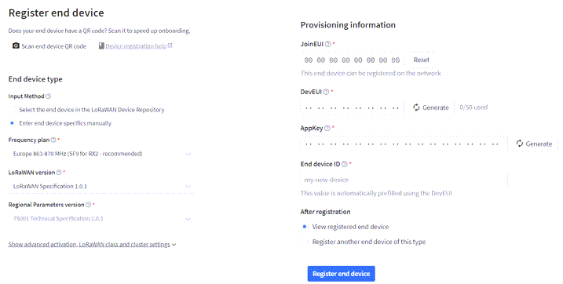

End device toevoegen 3/4: DevEUI opvragen
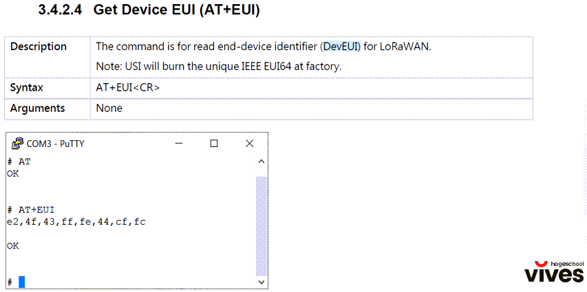

End device toevoegen 4/4: register end device
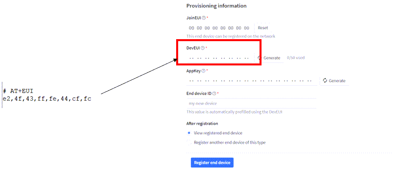

Na deze stappen is het noodzakelijk om het End device te initialiseren en een join te laten uitvoeren. Dit doe je door volgende commando's uit te voeren:

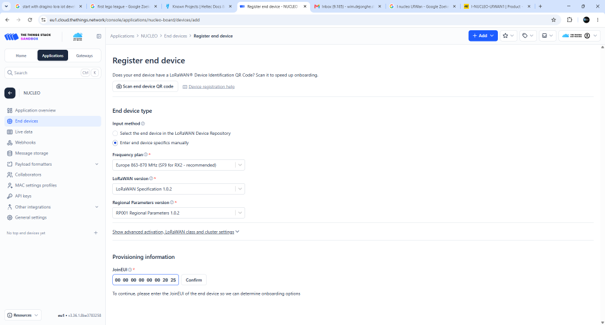


Neem voor `JOINEUI` een waarde die voor u herkenbaar is. 

:::tip
Plaats in het nummer bijvoorbeeld het schooljaar.
:::


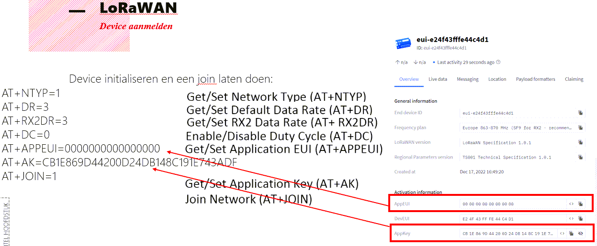

:::warning
Zorg dat de `AT+APPEUI` nummer hetzelfde is als van `JOINEUI` in vorige figuur!!
:::

Op de Things Network kan je de Live data van het End device zien:

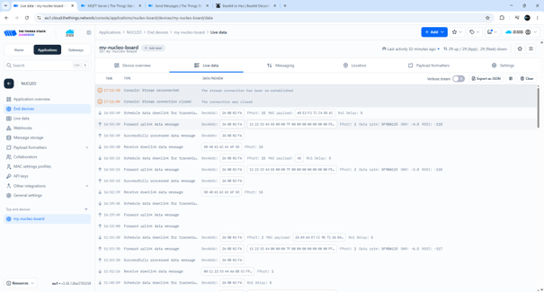

### Data verzenden vanaf de node naar TTN

Eenmaal je JOIN is accepted (wat wil zeggen dat je verbinding hebt met een LoRa gateway en dat uw device herkent wordt door TTN)

Je krijgt een dergelijk bericht in de Live Data van TTN:

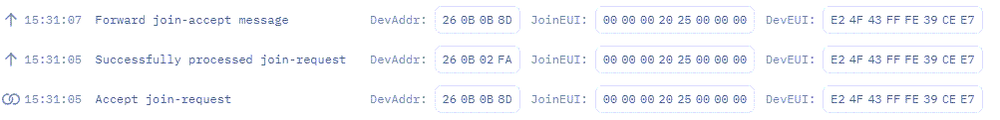

```text
AT+NTYP=1
TX: AT+NTYP=1
RX: OK
AT+DR=3
TX: AT+DR=3
RX: OK
AT+RX2DR=3
TX: AT+RX2DR=3
RX: OK
AT+DC=0
TX: AT+DC=0
RX: OK
AT+APPEUI=0000002025000000
TX: AT+APPEUI=0000002025000000
RX: OK
AT+AK=059A707A9ADDC4969763A34031699327
TX: AT+AK=059A707A9ADDC4969763A34031699327
RX: OK
AT+JOIN=1
TX: AT+JOIN=1
RX: OK
AT+SEND=2,000000000000007F0000000000000000,1
TX: AT+SEND=2,000000000000007F0000000000000000,1
RX: OK
```

In het laatste commando zie AT+SEND.

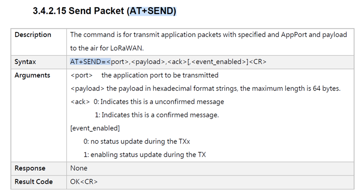

De data bestaat dus uit 32 hex getallen of 32 bytes. Het getal 2 is een poort getal en de 1 verwijst naar onmiddelijke verzending.

:::warning
Het zal dus hier aan de student zijn om een manier te vinden om sensor data van de END node is zo een formaat te gieten!!! En het dan later bij een dashboard dit terug te ontcijferen.
:::

***********************************************

Indien er data zou klaar staan om te ontvangen dat zal end node dit na een SEND ook receiven!!! Je moet dus telkens het initiatief nemen (SEND) om data als END node te ontvangen!!
Verstuur eens data vanuit TTN naar een END Node:

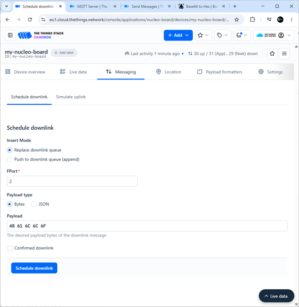

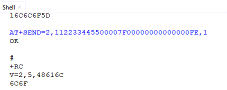

### MQTT

MQTT broker op de TTN kan je gebruiken om data uit te wisselen:

[MQTT broker info op TTN](https://www.thethingsindustries.com/docs/integrations/other-integrations/mqtt/)

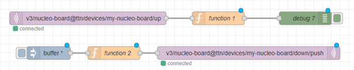

Met Function1:

```javascript
msg.payload = Buffer.from(msg.payload.uplink_message.frm_payload, "base64").toString("hex");
return msg;

```

Met Function2:

```javascript
return {
    "payload": {
        "downlinks": [{
            "f_port": 15,
            "frm_payload": msg.payload.toString("base64"),
            "priority": "NORMAL"
        }]
    }
}
```

In  de inject node zit een buffer met als inhoud :

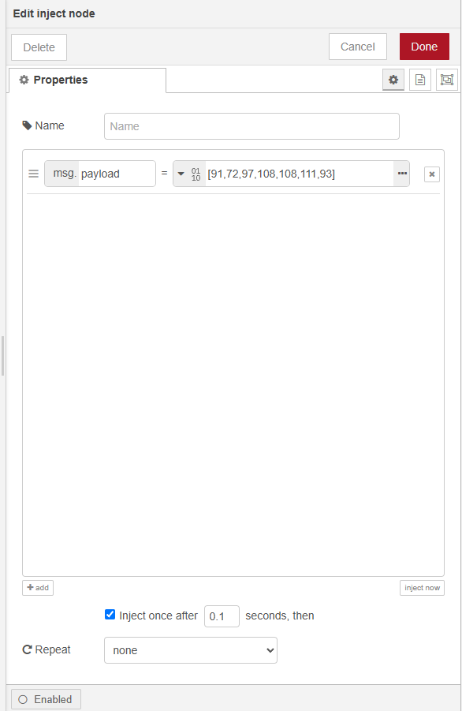


## Opdrachten:

<div style="background-color:darkgreen; text-align:left; vertical-align:left; padding:15px;">
<p style="color:lightgreen; margin:10px">
Opdracht1: ESP32 in deepsleep en wakeup op basis van tijd.
<ul style="color: white;">
<li>Breng de ESP32 in een cyclus van 20 seconden werken (laat een LED knipperen op een frequentie van 10Hz).</li>
<li>Na deze cyclus gaat de ESP32 voor 20 seconden in een deepsleep, waarna de cyclus zich herhaalt.</li>
<li>Meet het stroomverbruik van de microcontroller, eens in werkmodus en eens in slaapmodus. Wat zijn die waarden? Wat is het totaal vermogen in deze twee toestanden?</li>
<li>Uitbreiding: registreer om de 20 seconden uw GPS locatie en publiceer deze locatie op een dashboard. Laat de microcontroller op een batterij werken. </li>
</ul>
</p>
</div>

-

<div style="background-color:darkgreen; text-align:left; vertical-align:left; padding:15px;">
<p style="color:lightgreen; margin:10px">
Opdracht3: ESP32 in deepsleep en wakeup op basis van tijd.
<ul style="color: white;">
<li>Maak een toepassing die de omgevingstemperatuur meet en die waarde om de 20 seconden publiceert op een MQTT broker topic. </li>
<li>Intussentijd zit de microcontroller in een deepsleep.</li>
<li>Maak een dashboard met de meetwaarde.</li>
<li>Uitbreiding: publiceer de waarde tevens in een database en pas dashboard aan zodat deze een historiek weergeeft.</li>
</ul>
</p>
</div>
